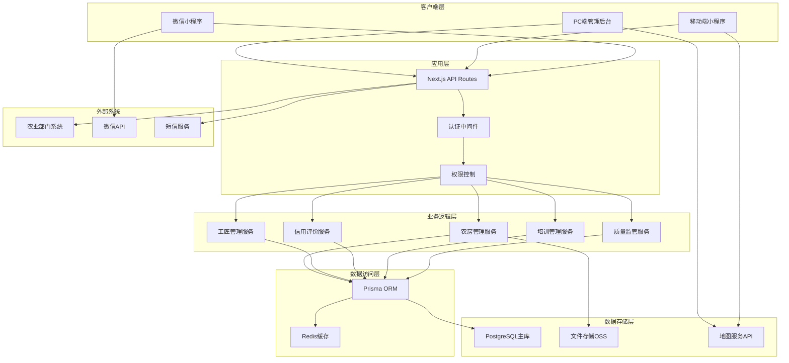
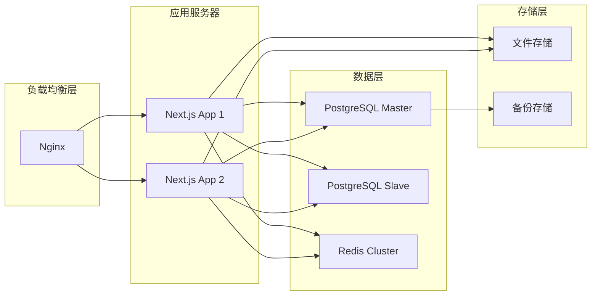
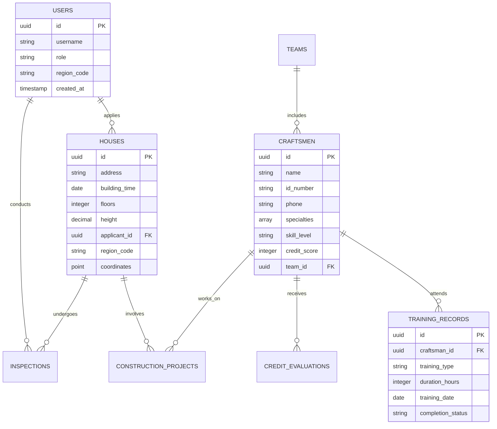

# 设计文档

## 概述

青岛市农房建设管理和乡村建设工匠培训信息平台是一个基于现代Web技术栈的综合性管理系统。系统采用前后端分离架构，支持PC端和移动端多终端访问，实现农房建设全生命周期管理和工匠培训信用评价的数字化转型。

### 技术栈选择

- **前端框架**: Next.js 14 (App Router)
- **构建工具**: Vite (用于开发环境优化)
- **包管理器**: pnpm
- **数据库**: PostgreSQL 15+
- **UI组件库**: Ant Design 5.x + Tailwind CSS + shadcn/ui
- **移动端**: Next.js PWA + 微信小程序

## 架构设计

### 系统架构图



### 部署架构



## 组件和接口设计

### 核心组件架构

#### 1. 农房管理组件 (HouseManagement)

```typescript
interface HouseManagementProps {
  region: string;
  permissions: UserPermissions;
}

// 主要功能模块
- HouseMapView: 农房地图展示组件
- HouseInfoPanel: 农房详细信息面板
- HouseConstructionTracker: 建设过程跟踪
- HouseInspectionForm: 质量检查表单
```

#### 2. 工匠管理组件 (CraftsmanManagement)

```typescript
interface CraftsmanManagementProps {
  craftsmanId?: string;
  viewMode: 'list' | 'detail' | 'training';
}

// 主要功能模块
- CraftsmanProfile: 工匠档案管理
- TrainingSchedule: 培训计划管理
- SkillAssessment: 技能评估组件
- CreditRating: 信用评级展示
```

#### 3. 移动端组件 (MobileComponents)

```typescript
// 小程序专用组件
- MobileHouseForm: 移动端农房申报表单
- PhotoUploader: 现场拍照上传组件
- LocationPicker: 位置选择器
- ApprovalWorkflow: 审批流程组件
```

### API接口设计

#### 农房管理API

```typescript
// GET /api/houses
interface GetHousesResponse {
  houses: House[]
  total: number
  pagination: PaginationInfo
}

// POST /api/houses
interface CreateHouseRequest {
  address: string
  buildingTime: Date
  floors: number
  height: number
  photos: string[]
  applicantId: string
}

// PUT /api/houses/:id/inspection
interface UpdateInspectionRequest {
  inspectionType: 'quality' | 'safety' | 'progress'
  result: InspectionResult
  photos: string[]
  inspector: string
}
```

#### 工匠管理API

```typescript
// GET /api/craftsmen
interface GetCraftsmenResponse {
  craftsmen: Craftsman[]
  filters: FilterOptions
  total: number
}

// POST /api/craftsmen/:id/training
interface AddTrainingRequest {
  trainingType: string
  duration: number
  certificate: string
  completionDate: Date
}

// PUT /api/craftsmen/:id/credit
interface UpdateCreditRequest {
  action: 'add' | 'deduct'
  points: number
  reason: string
  evidence: string[]
}
```

## 数据模型设计

### 核心数据表结构

#### 农房信息表 (houses)

```sql
CREATE TABLE houses (
    id UUID PRIMARY KEY DEFAULT gen_random_uuid(),
    address VARCHAR(500) NOT NULL,
    building_time DATE,
    floors INTEGER,
    height DECIMAL(5,2),
    house_type VARCHAR(50),
    construction_status VARCHAR(50),
    applicant_id UUID REFERENCES users(id),
    region_code VARCHAR(20),
    coordinates POINT,
    created_at TIMESTAMP DEFAULT NOW(),
    updated_at TIMESTAMP DEFAULT NOW()
);

CREATE INDEX idx_houses_region ON houses(region_code);
CREATE INDEX idx_houses_status ON houses(construction_status);
CREATE INDEX idx_houses_location ON houses USING GIST(coordinates);
```

#### 工匠信息表 (craftsmen)

```sql
CREATE TABLE craftsmen (
    id UUID PRIMARY KEY DEFAULT gen_random_uuid(),
    name VARCHAR(100) NOT NULL,
    id_number VARCHAR(18) UNIQUE,
    phone VARCHAR(20),
    specialties TEXT[],
    skill_level VARCHAR(20),
    credit_score INTEGER DEFAULT 100,
    certification_level VARCHAR(20),
    team_id UUID REFERENCES teams(id),
    region_code VARCHAR(20),
    status VARCHAR(20) DEFAULT 'active',
    created_at TIMESTAMP DEFAULT NOW(),
    updated_at TIMESTAMP DEFAULT NOW()
);

CREATE INDEX idx_craftsmen_region ON craftsmen(region_code);
CREATE INDEX idx_craftsmen_skill ON craftsmen(skill_level);
CREATE INDEX idx_craftsmen_credit ON craftsmen(credit_score);
```

#### 培训记录表 (training_records)

```sql
CREATE TABLE training_records (
    id UUID PRIMARY KEY DEFAULT gen_random_uuid(),
    craftsman_id UUID REFERENCES craftsmen(id),
    training_type VARCHAR(100),
    training_content TEXT,
    duration_hours INTEGER,
    training_date DATE,
    completion_status VARCHAR(20),
    certificate_url VARCHAR(500),
    instructor VARCHAR(100),
    created_at TIMESTAMP DEFAULT NOW()
);
```

#### 信用评价表 (credit_evaluations)

```sql
CREATE TABLE credit_evaluations (
    id UUID PRIMARY KEY DEFAULT gen_random_uuid(),
    craftsman_id UUID REFERENCES craftsmen(id),
    evaluation_type VARCHAR(50),
    points_change INTEGER,
    reason TEXT,
    evidence_urls TEXT[],
    evaluator_id UUID REFERENCES users(id),
    evaluation_date DATE,
    created_at TIMESTAMP DEFAULT NOW()
);
```

### 数据关系图



## 错误处理

### 错误分类和处理策略

#### 1. 客户端错误处理

```typescript
// 统一错误处理中间件
export class ErrorHandler {
  static handleApiError(error: ApiError) {
    switch (error.code) {
      case 'VALIDATION_ERROR':
        return { message: '数据验证失败', details: error.details }
      case 'PERMISSION_DENIED':
        return { message: '权限不足', redirect: '/login' }
      case 'RESOURCE_NOT_FOUND':
        return { message: '资源不存在' }
      default:
        return { message: '系统错误，请稍后重试' }
    }
  }
}
```

#### 2. 服务端错误处理

```typescript
// API路由错误处理
export async function handleApiRequest(
  handler: (req: NextRequest) => Promise<Response>
) {
  try {
    return await handler(req)
  } catch (error) {
    if (error instanceof ValidationError) {
      return NextResponse.json(
        { error: 'VALIDATION_ERROR', details: error.details },
        { status: 400 }
      )
    }

    if (error instanceof DatabaseError) {
      console.error('Database error:', error)
      return NextResponse.json({ error: 'DATABASE_ERROR' }, { status: 500 })
    }

    return NextResponse.json({ error: 'INTERNAL_ERROR' }, { status: 500 })
  }
}
```

#### 3. 数据库错误处理

```typescript
// Prisma错误处理
export function handlePrismaError(error: any) {
  if (error.code === 'P2002') {
    return new ValidationError('数据重复')
  }

  if (error.code === 'P2025') {
    return new NotFoundError('记录不存在')
  }

  return new DatabaseError('数据库操作失败')
}
```

## 测试策略

### 测试金字塔

#### 1. 单元测试 (70%)

```typescript
// 组件测试示例
describe('HouseManagement', () => {
  it('should render house list correctly', () => {
    const mockHouses = [
      { id: '1', address: '测试地址1', floors: 2 }
    ];

    render(<HouseManagement houses={mockHouses} />);
    expect(screen.getByText('测试地址1')).toBeInTheDocument();
  });
});

// API测试示例
describe('/api/houses', () => {
  it('should create house successfully', async () => {
    const houseData = {
      address: '测试地址',
      floors: 2,
      applicantId: 'user-1'
    };

    const response = await POST('/api/houses', houseData);
    expect(response.status).toBe(201);
  });
});
```

#### 2. 集成测试 (20%)

```typescript
// 数据库集成测试
describe('House Service Integration', () => {
  beforeEach(async () => {
    await setupTestDatabase()
  })

  it('should create house with related data', async () => {
    const house = await houseService.create({
      address: '测试地址',
      applicantId: 'user-1',
    })

    expect(house.id).toBeDefined()
    expect(house.applicant).toBeDefined()
  })
})
```

#### 3. E2E测试 (10%)

```typescript
// Playwright E2E测试
test('complete house application flow', async ({ page }) => {
  await page.goto('/houses/apply')

  await page.fill('[data-testid=address]', '测试地址')
  await page.fill('[data-testid=floors]', '2')
  await page.click('[data-testid=submit]')

  await expect(page.locator('.success-message')).toBeVisible()
})
```

### 测试环境配置

#### 1. 测试数据库设置

```typescript
// jest.setup.js
import { PrismaClient } from '@prisma/client'

const prisma = new PrismaClient({
  datasources: {
    db: {
      url: process.env.TEST_DATABASE_URL,
    },
  },
})

beforeEach(async () => {
  await prisma.$transaction([
    prisma.houses.deleteMany(),
    prisma.craftsmen.deleteMany(),
    prisma.users.deleteMany(),
  ])
})
```

#### 2. Mock服务配置

```typescript
// 外部服务Mock
export const mockExternalServices = {
  agricultureAPI: {
    getHouseData: jest.fn().mockResolvedValue({
      houses: [],
    }),
  },

  wechatAPI: {
    sendMessage: jest.fn().mockResolvedValue({
      success: true,
    }),
  },
}
```

### 性能测试

#### 1. 负载测试指标

- 并发用户数: 1000+
- 响应时间: < 2秒 (95%请求)
- 吞吐量: 500 RPS
- 数据库连接池: 20-50连接

#### 2. 监控指标

```typescript
// 性能监控中间件
export function performanceMiddleware(req: NextRequest) {
  const start = Date.now()

  return new Promise((resolve) => {
    const end = Date.now()
    const duration = end - start

    // 记录性能指标
    console.log(`${req.method} ${req.url} - ${duration}ms`)

    if (duration > 2000) {
      console.warn('Slow request detected:', req.url)
    }
  })
}
```

这个设计文档涵盖了系统的整体架构、组件设计、数据模型、错误处理和测试策略，为后续的开发实施提供了详细的技术指导。
